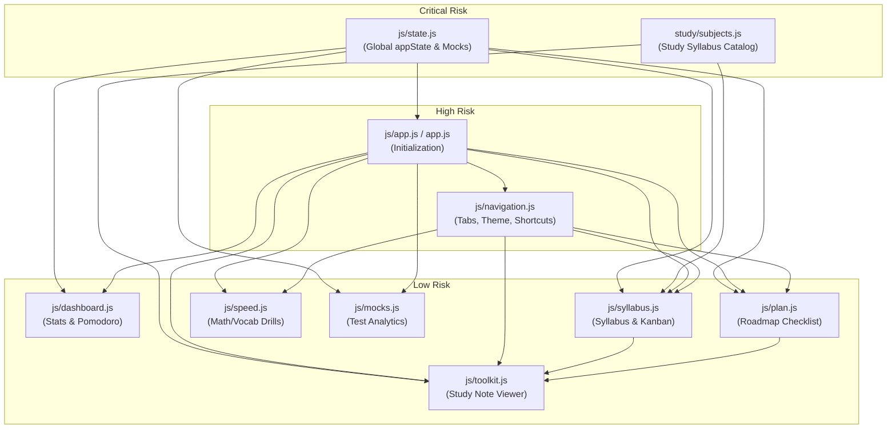

# Codebase Blast Radius Map — GitNexus

This document maps the architectural "blast radius" (the propagation of breaks or regressions) across the scripts in the **CGL Conquest** dashboard project. The values and relations are derived from the GitNexus graph index (**442 symbols, 994 relationships**).

---

## 1. High-Level Dependency Graph

The project is structured as a single-page application (SPA). All page views are loaded globally on startup by `js/app.js`, referencing shared configurations in `js/state.js` and `study/subjects.js`.

---

## 2. Blast Radius Matrix by File

| Target File | Risk Level | Direct Downstream Callers (d=1) | What Breaks if Changed (The Blast Radius) |
| :--- | :---: | :--- | :--- |
| **`js/state.js`** | **CRITICAL** | `js/app.js` `js/dashboard.js` `js/syllabus.js` `js/plan.js` `js/mocks.js` | Modifying the schema of `appState`, `SYLLABUS_DATA`, or `PLAN_DATA` will cause startup crashes or render failures across all tabs. |
| **`study/subjects.js`** | **HIGH** | `js/syllabus.js` `js/toolkit.js` | Defines the mapping layout for study notes. If corrupted, syllabus items will fail to open learning modals, and note navigation (Prev/Next) will fail. |
| **`js/navigation.js`** | **HIGH** | `js/app.js` | Manages page routing, keyboard shortcut triggers, theme toggling, and scroll locking. Buggy edits here can freeze the screen layout or block user navigation. |
| **`js/app.js`** | **HIGH** | None (DOM Entrypoint) | Binds the `DOMContentLoaded` startup pipeline. Any runtime exception halts script executions, leaving the screen completely blank on load. |
| **`js/toolkit.js`** | **MEDIUM** | `js/syllabus.js` `js/plan.js` | Manages the study notes viewer modal. Issues here will prevent users from opening markdown notes from the syllabus/timeline. |
| **`js/syllabus.js`** | **LOW** | `js/navigation.js` | Renders trees, compact lists, tables, grid cards, and Kanban columns. Errors only affect the Syllabus view. |
| **`js/dashboard.js`** | **LOW** | `js/app.js` | Renders overview metrics, countdown timers, and Pomodoro controls. Errors only affect the Dashboard screen. |
| **`js/plan.js`** | **LOW** | `js/navigation.js` | Handles the study plan timeline checklist. Errors are scoped to the Study Plan tab. |
| **`js/speed.js`** | **LOW** | `js/app.js` | Manages practice quizzes and speed math drills. Errors are scoped to the Drills tab. |
| **`js/mocks.js`** | **LOW** | `js/app.js` | Processes mock exam analytics and SVG charts. Errors are scoped to the Mock Analytics tab. |

---

## 3. Key Inter-file Execution Flows

### 1. Unified Study Note Display Flow
When a user clicks on a topic to study inside the Syllabus or Study Plan:
1. `tryOpenStudyNote(subtopicId)` inside `js/syllabus.js` is triggered.
2. It invokes `openStudyViewer(subtopicId)` which is globally exposed by `js/toolkit.js`.
3. `js/toolkit.js` parses the file from the `study/` directory and renders it into `#modal-study-viewer`.

> [!IMPORTANT]
> **Impact Warning:** If `window.openStudyViewer` is renamed or missing, clicking syllabus tiles will throw a Javascript TypeError, breaking user study flows.

### 2. Page Navigation & Keybinding Interception
1. Global keyboard keypresses are handled by the `keydown` event listener in `js/navigation.js`.
2. It checks page target mappings or overlays like `#modal-study-viewer`'s active state.
3. It calls the respective renderers (`renderSyllabus`, `renderStudyPlan`, etc.) dynamically.

> [!WARNING]
> **Impact Warning:** Changing `initNavigation` or keyboard callbacks can cause the application to ignore user input or loop keys endlessly.
